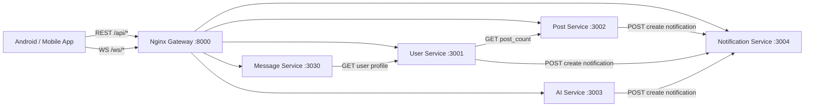

# AIFeed — AI Social Microservices

Backend microservices (Django) cho ứng dụng mạng xã hội AI có: **feed + post + chat realtime + notification realtime + AI generate**.

## 0) Quick Facts

- Gateway: **Nginx** (Windows bundle) — `http://localhost:8000`
- Services:
  - User Service — `http://localhost:3001`
  - Post Service — `http://localhost:3002`
  - AI Service — `http://localhost:3003`
  - Notification Service — `http://localhost:3004`
  - Message Service — `http://localhost:3030`

## 1) Tech Stack

- **Python** 3.x
- **Django**: đa số service dùng Django 4.2.x; Message Service đang là Django 5.1.x
- **Django REST Framework (DRF)**: REST APIs
- **Django Channels + Daphne**: WebSocket (chat, notifications)
- **Nginx**: reverse proxy/gateway (REST + WebSocket)
- **PostgreSQL**: database (mỗi service dùng DB riêng qua biến môi trường)
- **Redis**: cache cho Post Service (theo cấu hình `CACHES`)
- **Cloudinary**: upload media (post media, chat image; AI trả URL)
- **Google Gemini (google-genai)**: AI generate image/prompt (audio hiện có nhánh demo URL)

## 2) Kiến trúc tổng thể

### 2.1) Gateway routing (đúng theo `nginx/conf/nginx.conf`)

- REST
  - `/api/users/*` → User Service (3001)
  - `/api/posts/*` → Post Service (3002)
  - `/api/ai/*` → AI Service (3003)
  - `/api/notifications/*` → Notification Service (3004)
  - `/api/chat/*` → Message Service (3030)
- WebSocket
  - `/ws/notifications/*` → Notification WS (3004)
  - `/ws/chat/*` → Chat WS (3030)

### 2.2) Sơ đồ (logical)



### 2.3) Ghi chú

- Thư mục `api_gateway/` có một Django proxy (forward request bằng `requests`) nhưng **không được `run_all_services.bat` khởi chạy**. Gateway thực tế hiện tại là **Nginx**.

## 3) Chạy hệ thống (Windows)

### 3.1) Run all

- Chạy toàn bộ: mở `run_all_services.bat`
  - Có thể truyền trực tiếp đường dẫn `python.exe` của venv:
    - Ví dụ: `run_all_services.bat "D:\\path\\to\\venv\\Scripts\\python.exe"`

### 3.2) Stop

- Dừng services: `stop_services.bat`

## 4) Cấu hình môi trường (.env)

Repo hiện chưa commit `.env` (thường bị `.gitignore`). Các service đang đọc biến môi trường DB theo dạng:

```env
# PostgreSQL (mỗi service có thể dùng DB/schema riêng)
DB_NAME=masterai
DB_USER=postgres
DB_PASSWORD=postgres
DB_HOST=127.0.0.1
DB_PORT=5432

# Cloudinary
CLOUDINARY_CLOUD_NAME=...
CLOUDINARY_API_KEY=...
CLOUDINARY_API_SECRET=...

# Gemini
GEMINI_API_KEY=...
```

Ghi chú:

- Post Service có cache Redis theo `redis://127.0.0.1:6379/1`.
- Nếu chưa có Redis: chạy nhanh bằng Docker `docker run --rm -p 6379:6379 redis:7`.

## 5) API Reference (theo code hiện tại)

Base URL khi đi qua gateway: `http://localhost:8000`

### 5.1) User Service — `/api/users/`

**Auth**

- `POST /api/users/register/` — Đăng ký
  - Body (JSON): `username`, `password`, `email?`, `avatar_url?`
- `POST /api/users/login/` — Đăng nhập
  - Body (JSON): `username`, `password`
- `POST /api/users/logout/` — Logout (demo)

**Users / Profile**

- `GET /api/users/` — Danh sách user
- `GET /api/users/<user_id>/` — Chi tiết user
  - Query: `current_user_id?` để trả `is_followed`
  - Service sẽ gọi Post Service: `GET /api/posts/count/<user_id>/` để trả `post_count`
- `GET /api/users/search/?q=...` — Tìm user theo username/email

**Follow**

- `POST /api/users/<user_id>/follow/` — Toggle follow/unfollow
  - URL param `user_id`: người được follow
  - Body (JSON): `follower_id` (người thao tác)
- (legacy)
  - `POST /api/users/follow/` — Follow (Body: `follower_id`, `following_id`)
  - `POST /api/users/unfollow/` — Unfollow (Body: `follower_id`, `following_id`)

### 5.2) Post Service — `/api/posts/`

**Posts**

- `POST /api/posts/` — Tạo post
  - Body: multipart form-data
    - Fields: `user_id`, `content`, `visibility?`
    - Files: `files[]` (image/voice) → upload Cloudinary
- `PUT|PATCH /api/posts/<post_id>/update/` — Cập nhật post + media
  - Body: multipart form-data
    - `content?`, `visibility?`
    - `kept_media` (list các URL giữ lại)
    - `files[]` (media mới)
- `DELETE /api/posts/<post_id>/` — Xóa mềm (is_deleted=true)

**Feed**

- `GET /api/posts/feed/` — 20 bài mới nhất (cache key `feed:global`)
- `GET /api/posts/recommend/?user_id=...` — Feed gợi ý theo `UserInteraction`

**Interactions**

- `POST /api/posts/<post_id>/like/` — Like/unlike
  - Body (JSON): `user_id`
- `GET /api/posts/<post_id>/comments/` — Danh sách comment (cache key `comments:<post_id>`)
- `POST /api/posts/<post_id>/comment/` — Thêm comment
  - Body (JSON): `user_id`, `content`, `username?`, `avatar?`, `parent?`

**User aggregation**

- `GET /api/posts/count/<user_id>/` — Đếm số post của user
- `GET /api/posts/user/<user_id>/` — Danh sách post của user (phân trang DRF)
- `GET /api/posts/user/<user_id>/likes/` — Danh sách post user đã like (phân trang DRF)

### 5.3) AI Service — `/api/ai/`

**Generate**

- `POST /api/ai/generate-image/` — Sinh ảnh
  - Body: multipart form-data
    - `user_id?` (được lưu vào lịch sử nếu có)
    - `prompt` (bắt buộc)
    - `aspect_ratio?` (vd: `1:1`, `9:16`, `16:9`)
    - `resolution?` (`1K` | `2K`)
    - `image?` (optional) → nếu có thì coi như nhánh avatar
- `POST /api/ai/enhance-prompt/` — Nâng cấp prompt ảnh
  - Body: form-data: `prompt`
- `POST /api/ai/generate-audio/` — Sinh audio (hiện trả URL demo)
  - Body: form-data: `user_id`, `prompt`

**History / Assets**

- `GET /api/ai/generations/?user_id=...&type=image|avatar|audio&page=1&limit=10` — Lịch sử (phân trang)
- `GET /api/ai/generations/search/?user_id=...&type=...&search=...&sort=newest|oldest&aspect_ratio=...&resolution_config=...` — Tìm/lọc lịch sử
- `POST /api/ai/add-asset/` — Lưu generation vào assets
  - Body: form-data: `user_id`, `generation_id`
- `GET /api/ai/assets/?user_id=...&type=...` — Danh sách assets

### 5.4) Notification Service — `/api/notifications/`

- `GET /api/notifications/?user_id=...` — 20 notifications mới nhất
- `POST /api/notifications/create/` — Tạo notification + broadcast realtime
  - Body (JSON) tối thiểu:
    - `recipient_id` (UUID)
    - `type` (`like`|`comment`|`follow`|`ai`|`system`)
    - `title`, `message`
  - Sender (khuyến nghị) gửi theo object để serializer map sang `sender_*`:
    - `sender: { id, username, avatar }`
  - Ghi chú: các field ngoài danh sách trên (ví dụ `data`, `sender_id`) hiện **không được serializer expose**, nên sẽ bị bỏ qua nếu gửi lên.
- `PUT|PATCH /api/notifications/<notification_id>/read/` — Mark as read

**WebSocket**

- `WS /ws/notifications/<user_id>/`
  - Server add vào group `user_<user_id>` và push JSON notification khi tạo mới

### 5.5) Message Service — `/api/chat/`

- `POST /api/chat/status/` — Update online status
  - Body (JSON): `user_id`, `is_online` (bool)
- `GET /api/chat/inbox/<user_id>/` — Danh sách hội thoại
  - Trả: last*message, unread_count, is_online, target_user*\* (gọi sang User Service)
- `GET /api/chat/history/<my_id>/<target_id>/` — Lịch sử chat + auto mark-as-read
- `POST /api/chat/upload-image/` — Upload ảnh chat
  - Body: multipart form-data: `image`

**WebSocket Chat**

- `WS /ws/chat/<my_id>/<target_id>/`
  - Room id: `chat_<min(my_id,target_id)>_<max(my_id,target_id)>`
  - Event:
    - chat: `{ message, message_type(0|1), image_url?, sender_id, timestamp }`
    - presence: `{ user_id, is_online }`

## 6) Data Models (tóm tắt)

### 6.1) User Service

- `User`
  - `id (UUID)`, `username`, `email?`, `password (hashed)`, `avatar_url?`, `created_at`
- `Follow`
  - `id (UUID)`, `follower_id (UUID)`, `following_id (UUID)`

### 6.2) Post Service

- `Post`
  - `id (UUID)`, `user_id (UUID)`, `content`, `visibility (public|private|friends)`, `like_count`, `comment_count`, `is_deleted`, `created_at`, `updated_at`
- `Media`
  - `id (UUID)`, `post (FK)`, `url`, `media_type (image|avatar|voice)`, `source (upload|ai)`, `ai_metadata? (JSON)`, `order`
- `Like`
  - `id (UUID)`, `user_id (UUID)`, `post (FK)`, `created_at`
- `Comment`
  - `id (UUID)`, `user_id (UUID)`, `post (FK)`, `content`, `parent? (self FK)`, `is_deleted`, `created_at`
- `UserInteraction`
  - `user_id (UUID)`, `post_id (UUID)`, `score (float)`, `updated_at`

### 6.3) AI Service

- `AIGeneration`
  - `id (UUID)`, `user_id (string)`, `generation_type (image|avatar|audio)`, `prompt`, `media_url`, `aspect_ratio?`, `resolution_config?`, `created_at`
- `UserAsset`
  - `id (UUID)`, `user_id (string)`, `generation? (FK)`, `asset_type`, `media_url`, `prompt?`, `created_at`

### 6.4) Notification Service

- `Notification`
  - `id (UUID)`, `recipient_id (UUID)`, `sender_id?`, `sender_name?`, `sender_avatar?`, `type`, `title`, `message`, `data? (JSON)`, `is_read`, `created_at`

### 6.5) Message Service

- `UserStatus`
  - `user_id (UUID)`, `is_online`, `last_active`
- `Message`
  - `id (UUID)`, `room_id`, `sender_id`, `receiver_id`, `text?`, `image_url?`, `message_type (0=text|1=image)`, `is_read`, `timestamp`
